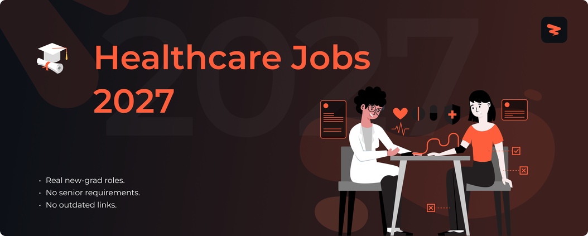

<!-- Cover -->

# Healthcare Jobs 2027

🚀 Healthcare and nursing jobs for new graduates, updated in real time.

> [!TIP]
> 🛠 Help us grow! Add new jobs by submitting an issue! View contributing steps [here](CONTRIBUTING-GUIDE.md).
---

## **Website & Autofill Extension**

Explore Zapply's website and check out:

- Our chrome extension that autofills your job applications in seconds.
- A dedicated job board with the latest jobs for various types of roles.
- User account providing multiple profiles for different resume roles.
- Job application tracking with streaks to unlock commitment awards.

Experience an advanced career journey with us! 🚀

  

## Explore Around

Connect and seek advice from a growing network of fellow students and new grads.

  
  &nbsp;&nbsp;
  
  &nbsp;&nbsp;
  

---

<h3>🏥 <strong>Nursing</strong></h3>

| Company | Role | Location | Posted | **Apply** |
|---------|------|----------|--------|----------|
| **Takeda** | Licensed Practical Nurse | IA | 11m |  |
| **Takeda** | Plasma Center Nurse – RN | ID | 11m |  |
| **Vertex Pharmaceuticals** | Field Reimbursement Manager - Kidney ... | United States Fie... | 11m |  |
| **Vertex Pharmaceuticals** | Field Reimbursement Manager - Kidney ... | United States Fie... | 11m |  |
| **Vertex Pharmaceuticals** | Field Reimbursement Manager - Kidney ... | United States Fie... | 11m |  |
| **LabCorp** | Phlebotomist/PRN - Location Varies-Or... | Orlando FL | 12m |  |
| **LabCorp** | Phlebotomist PRN - Location Varies/Or... | Orlando FL | 12m |  |
| **Elevance Health** | LTSS Service Coordinator-RN Clinician | Virginia Virginia... | 13m |  |
| **Cigna** | Telephonic Registered Nurse Clinical ... | United States Wor... | 13m |  |
| **Cigna** | (RN) Nurse Case Manager - Evernorth H... | United States Wor... | 13m |  |
| **CVS Health** | Pharmacy Intern | Oakland Park, FL | 13m |  |
| **CVS Health** | Licensed Vocational Nurse (LVN) | Round Rock, TX | 13m |  |
| **CVS Health** | Registered Nurse Case Manager - Field... | IL Chicago + 2 more | 13m |  |
| **Bristol Myers Squibb** | Clinical Nurse Consultant, Chicago | IL | 13m |  |
| **Bristol Myers Squibb** | Clinical Nurse Consultant- Michigan | Detroit MI US + 2... | 13m |  |
| **Fresenius Medical Care** | Acute Inpatient Registered Nurse - RN | Las Cruces, NM | 24m |  |
| **Fresenius Medical Care** | Registered Nurse - RN - Dialysis | Tualatin, OR | 24m |  |
| **Fresenius Medical Care** | Patient Care Technician - PCT CCHT - ... | Gardendale, AL | 24m |  |
| **Insulet Corporation** | Project Manager, Internal Evaluations... | Acton, Massachusetts | 28m |  |
| **Atlantic Health System** | Registered Nurse Full Time Days 7a-7p... | Pompton Plains, N... | 16h |  |
| **Atlantic Health System** | Registered Nurse Full Time Days 7a-7p... | Pompton Plains, N... | 16h |  |
| **AbbVie** | Oncology Nurse Educator - TX, OK, AR | Houston, TX | 1d |  |
| **AbbVie** | Oncology Nurse Educator - TX, OK, AR | Dallas, TX | 1d |  |
| **Highmark Health** | Patient Care Technician - 5A Telemetr... | Pittsburgh PA, 15212 | 3d |  |
| **Highmark Health** | RN Cardiac Lab Unit (CLU) - Allegheny... | Pittsburgh PA, 15212 | 3d |  |
| **Highmark Health** | RN Float Pool Part Time (Team 2 Med S... | Pittsburgh PA, 15212 | 3d |  |
| **Takeda** | Registered Nurse RN | ND | 4d |  |
| **Medtronic** | Clinical Specialist, Pain Interventio... | Charlotte, North ... | 4d |  |
| **Elevance Health** | Diagnosis Related Group Clinical Vali... | Denver, CO | 4d |  |
| **Elevance Health** | Registered Nurse (PRN) – Paragon Infu... | 2 Locations | 4d |  |
| **Cigna** | Bilingual Health Coach - Evernorth - ... | Miami, FL | 4d |  |
| **Cardinal Health** | PRN Pharmacy Technician | Harrisonville, MO | 4d |  |
| **Cardinal Health** | Hospital Pharmacy Technician PRN | Rio Grande City, TX | 4d |  |
| **Cardinal Health** | PRN Pharmacy Technician | PAM Health Rehab ... | 4d |  |
| **Bristol Myers Squibb** | Clinical Nurse Consultant- Pennsylvania | United States | 4d |  |
| **Atlantic Health System** | Registered Nurse - Full time, Days - ... | Morristown, NJ, U... | 4d |  |
| **KBR** | Special Operations Licensed Clinical ... | Fort Liberty, Nor... | 5d |  |
| **GDIT** | Psychiatric-Mental Health Nurse Pract... | 4 Locations | 5d |  |
| **Biogen** | Scientist II, Antisense/siRNA and Pep... | Cambridge, MA | 5d |  |
| **Wash U** | Mental Health Nurse Practitioner (PMH... | Missouri Baptist ... | 5d |  |
| **Wash U** | Nurse Practitioner - Hematology | Washington Univer... | 5d |  |
| **Wash U** | Nurse Practitioner - Rheumatology | Washington Univer... | 5d |  |
| **Exact Sciences** | Regional Oncology Specialist - Centra... | CA Fresno + 1 more | 5d |  |
| **Boys Town** | Registered Nurse - Inpatient Medical ... | Omaha, NE | 5d |  |
| **Boys Town** | Registered Nurse - IMU | Omaha, NE | 5d |  |
| **Boys Town** | Inpatient Psychiatric Unit Social Wor... | Omaha, NE | 5d |  |
| **Abbott** | Plant Occupational Health Nurse 2nd S... | Virginia | 5d |  |
| **IDEXX** | Laboratory Technician - Overnight | Glen Burnie, MD | 5d |  |
| **Eurofins** | Shipping/Receiving Technician, Eurofi... | Auburn, ME | 5d |  |
| **Abbott** | Registered Nurse - Patient Educator (... | South Dakota | 6d |  |
| **Abbott** | Registered Nurse - Patient Educator (... | Michigan | 6d |  |
| **Oscar Health** | Nurse Practitioner or Physician Assis... | New York, New Yor... | 6d |  |
| **Eurofins** | Sample Registration Support Technicia... | Lancaster, PA | 6d |  |
| **Delta Dental** | Internship - Application Development | Okemos, MI | 1w |  |
| **NREL** | Graduate Intern – AI-Assisted Autonom... | Golden, CO | 3w |  |
| **Delta Dental** | Internship - Application Development | Okemos, MI | 3w |  |
| **Generac** | Lab Technician Intern | Santa Monica, CA ... | 1mo |  |
| **Delta Dental** | Internship - Compliance Training and ... | Okemos, MI | 1mo |  |
| **Flagship Pioneering** | Serif Biomedicines, Market Intelligen... | Cambridge, MA USA | 1mo |  |
| **AbbVie** | Veteran SkillBridge Program Intern | North Chicago, IL | 2mo |  |

Apply for more jobs at

<h3>🔬 <strong>Research & Laboratory</strong></h3>

| Company | Role | Location | Posted | **Apply** |
|---------|------|----------|--------|----------|
| **Bristol Myers Squibb** | Scientist, Manufacturing Technology | MA | 13m |  |
| **AstraZeneca** | Scientist, Viral Vector Process Devel... | MD | 13m |  |
| **Biogen** | (Sr) Medical Science Liaison, Multipl... | Dallas, TX + 1 more | 14m |  |
| **Bio-Techne** | Field Applications Scientist, Immunoa... | Remote | 29m |  |
| **AbbVie** | Lab Technician IV - Cell Culture | Worcester, MA | 40m |  |
| **Eurofins** | Routine HPLC Scientist | Cambridge, MA | 44m |  |
| **Pfizer** | Process Engineer/Scientist II | Massachusetts | 56m |  |
| **Olsson** | Associate Scientist - Industrial Envi... | North Kansas City... | 1h |  |
| **Eurofins** | In-Vivo Support Scientist | West Point, PA | 1h |  |
| **AbbVie** | Clinical Research Associate I - Littl... | Little Rock, AR | 1h |  |
| **IDEXX** | Medical Lab Technician | Louisville, KY | 1h |  |
| **Intuitive** | Clinical Data Manager | Sunnyvale, CA | 1h |  |
| **AbbVie** | Scientist I | Worcester, MA | 2h |  |
| **Olsson** | Associate Scientist - Energy Environm... | Dallas, TX; Oklah... | 3h |  |
| **Eurofins** | Formulations Scientist | Rahway, NJ | 3h |  |
| **Sherwin-Williams** | Quality Lab Technician - 2nd Shift | Grove City, OH, U... | 16h |  |
| **Sherwin-Williams** | Quality Control Lab Technician | Rockford, IL, Uni... | 16h |  |
| **TD Bank** | Data Scientist II - FCRM -Screening C... | New York New York... | 3d |  |
| **Veolia Environnement SA** | Lab Technician | Ewa Beach, HI | 3d |  |
| **Medtronic** | Clinical Research Specialist, ICT | Mounds View, Minn... | 4d |  |
| **LabCorp** | Dose Formulation Technician – 3rd Shift | WI | 4d |  |
| **LabCorp** | Clinical Laboratory Technician  - Mic... | Tampa FL | 4d |  |
| **LabCorp** | Clinical Lab scientist - Microbiology | San Diego CA | 4d |  |
| **Cardinal Health** | Laboratory Technician | Sacramento PET, CA | 4d |  |
| **Bristol Myers Squibb** | Clinical Research Associate (m/w/d) –... | Field Germany, DE... | 4d |  |
| **Wash U** | Clinical Research Coordinator IV (Tim... | Washington Univer... | 4d |  |
| **Thermo Fisher Scientific** | Assoc Clinical Research Mgr | Austin, Texas, USA | 4d |  |
| **Thermo Fisher Scientific** | Clinical Research Manager | Las Vegas, Nevada... | 4d |  |
| **Thermo Fisher Scientific** | Associate Clinical Research Manager | Austin, Texas, USA | 4d |  |
| **Zoetis** | Laboratory Technician – Fermentation ... | Lincoln | 4d |  |
| **Merck & Co.** | Scientist, Pharmacokinetics | Pennsylvania | 4d |  |
| **Exact Sciences** | Pre-Analytical Laboratory Technician II | Redwood City, CA | 4d |  |
| **Pfizer** | Associate Scientist (Vaccines) | New York | 4d |  |
| **Pfizer** | Associate Scientist, Bioassay and Imp... | Massachusetts | 4d |  |
| **Becton Dickinson** | QM Associate Scientist | Hunt Valley | 4d |  |
| **Iterative Health** | Clinical Research Coordinator II | Tucson, Arizona | 4d |  |
| **Iterative Health** | Clinical Research Coordinator I | Tucson, Arizona | 4d |  |
| **Sherwin-Williams** | Quality Control Lab Technician Part-T... | Memphis, TN, Unit... | 4d |  |
| **Rocket Lab** | Materials Lab Technician II | Long Beach, CA | 4d |  |
| **Guidehouse** | Laboratory Technician | MD, Baltimore | 5d |  |
| **Cardinal Health** | Scientist I - CMC | FIELD | 5d |  |
| **Cardinal Health** | Scientist III - CMC | FIELD | 5d |  |
| **Bristol Myers Squibb** | Medical Science Liaison, Cell Therapy... | TX | 5d |  |
| **AstraZeneca** | Medical Science Liaison - Immunology ... | Philadelphia, PA ... | 5d |  |
| **AstraZeneca** | Medical Science Liaison - Immunology ... | CA | 5d |  |
| **Fresenius Medical Care** | Clinical Educator Manager | Battle Ground, WA | 5d |  |
| **Carnegie Mellon University** | Postdoctoral Research Associate – Cog... | Pittsburgh, PA | 5d |  |
| **Carnegie Mellon University** | Postdoctoral Research Associate - Rob... | Pittsburgh, PA | 5d |  |
| **Wash U** | Clinical Research Coordinator I - Neu... | Washington Univer... | 5d |  |
| **Wash U** | Clinical Research Coordinator I (Clin... | Washington Univer... | 5d |  |
| **Merck & Co.** | Scientist, Pharmacokinetics | California | 5d |  |
| **IDEXX** | Laboratory Technician - 3rd Shift | Greensboro, NC | 5d |  |
| **IDEXX** | Laboratory Technician | Glen Burnie, MD | 5d |  |
| **Amazon.com Services LLC** | Data Scientist II, AWS Managed Operat... | Arlington, VA | 5d |  |
| **Fortive** | Scientist II | Irvine, CA, Unite... | 5d |  |
| **Honeywell** | Data Scientist II | Pittsford, NY, Un... | 5d |  |
| **Iterative Health** | Clinical Research Coordinator II - Tu... | Tucson, AZ | 5d |  |
| **TD Bank** | Equity Research Associate - Healthcar... | New York, New York | 6d |  |
| **KBR** | Data Scientist II | Arlington, Virginia | 6d |  |
| **KBR** | Data Scientist I | Arlington, Virginia | 6d |  |
| **Guidehouse** | Laboratory Technician | MD, Bethesda | 6d |  |
| **Caterpillar** | Data Scientist II | Nashville, Tennessee | 6d |  |
| **Boeing** | Mid-Level C-17 Support Equipment Lab ... | Long Beach, CA | 6d |  |
| **Merck & Co.** | Assoc Prin. Scientist, Materials Science | New Jersey | 6d |  |
| **Blue Origin** | Avionics Dev Lab Technician Level II | Greater Seattle Area | 6d |  |
| **Blue Origin** | Avionics Dev Lab Technician Level I | Greater Seattle Area | 6d |  |
| **Blue Origin** | Avionics Dev Lab Technician Level II | Greater Seattle Area | 6d |  |
| **Amazon.com Services LLC** | Data Scientist II, NASC S&OP | Bellevue, WA | 6d |  |
| **Intuitive** | Clinical Research Engineer - Future F... | Sunnyvale, CA | 6d |  |

Apply for more jobs at

<h3>💼 <strong>Business & Operations</strong></h3>

| Company | Role | Location | Posted | **Apply** |
|---------|------|----------|--------|----------|
| **Medtronic** | Clinical Specialist - CardioVascular ... | 9 Locations | 12m |  |
| **Medtronic** | Clinical Specialist, Pain Interventio... | Long Island, New ... | 12m |  |
| **KBR** | Special Operations Licensed Mental He... | Tucson, Arizona | 12m |  |
| **Leidos** | MFLC Counselor Short Term or As Neede... | Tacoma, WA | 26m |  |
| **Highmark Health** | Patient Access Coordinator I / Regist... | Pittsburgh PA, 15212 | 42m |  |
| **Takeda** | Entry Level Phlebotomist/Medical Scre... | DE | 3d |  |
| **Medtronic** | Clinical Specialist, Deep Brain Stimu... | Miami, Florida, U... | 3d |  |
| **Takeda** | Medical Screener/Phlebotomist | UT | 4d |  |
| **Takeda** | Medical Screener/Phlebotomist | UT | 4d |  |
| **Elevance Health** | Behavioral Health Care Manager II - ABA | 11 Locations | 4d |  |
| **Elevance Health** | Medical Coding Appeals Analyst | 3 Locations | 4d |  |
| **Elevance Health** | Behavioral Health Care Manager II - A... | 5 Locations | 4d |  |
| **Wash U** | Physical Therapist/Clinical Associate... | Washington Univer... | 4d |  |
| **Wash U** | Genetic Clinical Counselor I - Pediat... | Washington Univer... | 4d |  |
| **Leidos** | Military and Family Life Counselor - ... | Leesville, LA + 1... | 4d |  |
| **Leidos** | Military Family Life Counselor - CDC ... | Oceanside, CA | 4d |  |
| **Highmark Health** | Radiation Therapist - AHN Cancer Inst... | 230 West North Av... | 4d |  |
| **Highmark Health** | Patient Access Coordinator II / ED - ... | Pittsburgh PA, 15... | 4d |  |
| **Boys Town** | Outpatient Behavioral Health Therapist | Omaha, NE | 4d |  |
| **KBR** | Special Operations Licensed Clinical ... | Fayetteville, Nor... | 5d |  |
| **Wash U** | Physical Therapist/Clinical Associate... | O'Fallon, MO | 5d |  |
| **Insulet Corporation** | Medical Affairs Coordinator (Hybrid) | Acton Massachuset... | 5d |  |
| **Exact Sciences** | Regional Oncology Specialist - Richmo... | VA Richmond + 3 more | 5d |  |
| **Abbott** | Clinical Specialist I, CPT - Gainesvi... | Florida | 5d |  |
| **Abbott** | Clinical Specialist I, CPT - Panama C... | Florida | 5d |  |
| **Abbott** | Clinical Specialist I, CPT - Charlest... | West Virginia | 5d |  |
| **Guidehouse** | Patient Account Representative - A/R ... | TX, Lewisville | 6d |  |
| **Atlantic Health System** | Licensed Physical Therapist Assistant... | Morristown, NJ, U... | 6d |  |
| **Atlantic Health System** | Licensed Physical Therapist Assistant... | Morristown, NJ, U... | 6d |  |

Apply for more jobs at

<h3>⚕️ <strong>General Healthcare & Clinical</strong></h3>

| Company | Role | Location | Posted | **Apply** |
|---------|------|----------|--------|----------|
| **Takeda** | Paramedic | IA | 11m |  |
| **Takeda** | Plasma Center Sample Processing Tech | IA | 11m |  |
| **Takeda** | Phlebotomist | IA | 11m |  |
| **Vertex Pharmaceuticals** | Medical Writing Manager (Hybrid) | Boston, MA | 11m |  |
| **Vertex Pharmaceuticals** | Field Reimbursement Manager - Kidney ... | United States Fie... | 11m |  |
| **Vertex Pharmaceuticals** | Field Reimbursement Manager - Kidney ... | United States Fie... | 11m |  |
| **LabCorp** | Phlebotomist Part Time - Semoran-Orla... | Orlando FL | 12m |  |
| **LabCorp** | Phlebotomist | Philadelphia PA | 12m |  |
| **LabCorp** | PST -  Experienced Phlebotomist | Chicago IL | 12m |  |
| **Guidehouse** | MSO Credit Balance Specialist | AL, Birmingham | 13m |  |
| **Disney** | Veterinary Technician | Lake Buena Vista,... | 13m |  |
| **Disney** | Veterinary Technician (Seasonal/Casua... | Lake Buena Vista,... | 13m |  |
| **Globus Medical** | Quality Control Inspector | Eagleville, PA | 13m |  |
| **Globus Medical** | Model Maker, 3D Printing, 2nd Shift | Audubon, PA | 13m |  |
| **Globus Medical** | CNC Model Maker, 2nd Shift | Audubon, PA | 13m |  |
| **Elevance Health** | Pharmacy Technician II - Data Entry B... | Las Vegas, NV | 13m |  |
| **Elevance Health** | Pharmacy Technician | Dothan, AL | 13m |  |
| **Elevance Health** | Peer Specialist - Nevada | Las Vegas, NV | 13m |  |
| **Cigna** | Pharmacy Technician (PACE) - Accredo ... | Nashville, TN + 6... | 13m |  |
| **Cigna** | Medication History Pharmacy Technicia... | United States Wor... | 13m |  |
| **Cardinal Health** | Manager, Revenue Management | FIELD | 13m |  |
| **CVS Health** | Pharmacy Technician | Palmetto, FL | 13m |  |
| **CVS Health** | Pharmacy Technician | Springboro, OH | 13m |  |
| **CVS Health** | Pharmacy Technician | Feasterville, PA | 13m |  |
| **Bristol Myers Squibb** | Specialist, AMER Site Accounts, Sched... | Giralda | 13m |  |
| **AstraZeneca** | Oncology Business Manager (Lung) - Mi... | St Louis, MO + 2 ... | 13m |  |
| **Fresenius Medical Care** | Student Social Work Clinical Placement | Jamaica, NY, USA | 24m |  |
| **Fresenius Medical Care** | Student Social Work Clinical Placement | Saugus, MA, USA | 24m |  |
| **Fresenius Medical Care** | Student Dietitian Clinical Placement | Germantown, TN, USA | 24m |  |
| **Wash U** | Medical Assistant II - Orthopedic Sur... | Chesterfield, MO | 25m |  |
| **Wash U** | Patient Care Associate (Trainee) - Or... | Chesterfield, MO | 25m |  |
| **Thermo Fisher Scientific** | Associate IRT Project Manager | Morrisville, Nort... | 26m |  |
| **Johnson & Johnson** | Associate Clinical Consultant/Clinica... | Orlando, Florida,... | 27m |  |
| **Highmark Health** | Social Worker - Palliative Care, Penn... | PA, Working at Ho... | 42m |  |
| **Eurofins** | Rail Inspector | Van Wert, OH | 1h |  |
| **Abbott** | 2027 Operations Professional Developm... | Illinois | 1h |  |
| **Abbott** | Clinical Associate | California | 1h |  |
| **Atlantic Health System** | Sonography Technologist | Summit, NJ, Unite... | 16h |  |
| **Atlantic Health System** | Courier - Per Diem - Variable - Mobil... | Livingston, NJ, U... | 16h |  |
| **Bristol Myers Squibb** | Specialist, Quality Assurance Shop Fl... | MA | 3d |  |
| **University of Texas at Austin** | Research Dietitian | AUSTIN, TX | 3d |  |
| **Thermo Fisher Scientific** | Associate Metrologist | Covington, Kentuc... | 3d |  |
| **Merck & Co.** | Cardiovascular Disease Specialist – M... | Tennessee | 3d |  |
| **Highmark Health** | Unit Secretary - ED - AGH - Full Time | Pittsburgh PA, 15212 | 3d |  |
| **Pfizer** | Cardiovascular Specialist, Health and... | United States Del... | 3d |  |
| **Boys Town** | Youth Care Worker - Evening Shift | Omaha, NE | 3d |  |
| **Eurofins** | Asbestos PLM Analyst (2nd Shift) Euro... | Tustin, CA | 3d |  |
| **Eurofins** | Laboratory Data Review Specialist,  E... | Tustin, CA | 3d |  |
| **Hologic** | Hologic Nurse Advocate | Louisville, CO, U... | 3d |  |
| **AbbVie** | District Manager, Chronic Migraine/Sp... | Chicago, IL | 3d |  |
| **AbbVie** | Batch Release Specialist | Tempe, AZ | 3d |  |
| **BillionToOne** | Automation Service Engineer I/II, Onc... | Menlo Park, CA | 3d |  |
| **GDIT** | Strength and Conditioning Specialists | NC Fort Bragg + 4... | 4d |  |
| **Guidehouse** | Biologist | MD, Bethesda | 4d |  |
| **Cigna** | Pharmacy Technician - Accredo - Marlb... | Marlborough, MA | 4d |  |
| **Cardinal Health** | Pharmacy Technician Buyer | Wesley Chapel, FL | 4d |  |
| **Cardinal Health** | Pharmacy Technician | South Bend, IN | 4d |  |
| **Bristol Myers Squibb** | Validation Associate Engineer | WA | 4d |  |
| **Caterpillar** | Nurse | East Peoria, Illi... | 4d |  |
| **Baxter International** | ECG Analysis Technician (Training Pro... | St Paul, Minnesota | 4d |  |
| **Baxter International** | Connected Solutions Technician - AM S... | Lexington, Kentucky | 4d |  |
| **Baxter International** | Tech II | Medina, New York | 4d |  |
| **Biogen** | Site Feasability Manager | Cambridge, MA | 4d |  |
| **Wash U** | Registered Dietitian Nutritionist (Pa... | Washington Univer... | 4d |  |
| **Thermo Fisher Scientific** | Global Market Development Manager, He... | Carlsbad, Califor... | 4d |  |
| **Merck & Co.** | Clinical Quality Operations, Oncology... | New Jersey Rahway... | 4d |  |
| **Johnson & Johnson** | Associate Clinical Consultant (Miami,... | Miami, Florida, U... | 4d |  |
| **Johnson & Johnson** | Associate Clinical Consultant (Fort L... | Ft. Lauderdale, F... | 4d |  |
| **Highmark Health** | Medical Assistant - Pulmonary - Alleg... | Pittsburgh PA, 15... | 4d |  |
| **Pfizer** | Cardiovascular Specialist, Health and... | Texas | 4d |  |
| **Pfizer** | Cardiovascular Specialist, Health and... | Florida | 4d |  |
| **Boys Town** | Child & Adolescent Psychiatrist | Omaha, NE | 4d |  |
| **Boys Town** | Pediatric Neurologist (Epileptologist) | Omaha, NE | 4d |  |
| **Oscar Health** | Manager, Optimization | Dallas, Texas, Un... | 4d |  |
| **Oscar Health** | Manager, Optimization | Tempe, Arizona, U... | 4d |  |
| **Oscar Health** | Manager, Optimization | Atlanta, Georgia,... | 4d |  |
| **Atlantic Health System** | Environmental Aide I - PT (3:00pm-11:... | Morristown, NJ, U... | 4d |  |
| **Commure** | Application Analyst | United States | 4d |  |
| **AbbVie** | Administrative Assistant, Neuroscienc... | North Chicago, IL | 4d |  |
| **Guidehouse** | Hematopathologist | MD, Bethesda | 5d |  |
| **Insulet Corporation** | SAP Business Process Principle - Dist... | Acton, Massachusetts | 5d |  |
| **Envista Holdings** | Dental Technician I – Procera Complete | NJ | 5d |  |
| **WSP** | On Call Biologist | Irvine, CA, Unite... | 5d |  |
| **Wellmark, Inc.** | Associate Product Owner - Pharmacy Op... | Des Moines, IA | 5d |  |
| **Baker Hughes** | AMO EMT | Tallmadge | 6d |  |
| **AstraZeneca** | Oncology Account Specialist (Gyn/GU) ... | Los Angeles, CA +... | 6d |  |
| **AstraZeneca** | Manager, Biosample Operations | – Santa Monica Co... | 6d |  |
| **Biogen** | Women’s Health Account Manager (Neuro... | Manhattan, NY | 6d |  |
| **iRhythm** | Manager, Clinical Quality | Deerfield, IL + 2... | 6d |  |
| **Merck & Co.** | Therapeutic Area Head, Late-Stage Onc... | New Jersey Rahway... | 6d |  |
| **Insulet Corporation** | Supplier Engineer - Electronics (Onsi... | Acton, Massachusetts | 6d |  |
| **Insulet Corporation** | Controls & Instrumentation Technician... | Massachusetts | 6d |  |
| **Exact Sciences** | Histology Assistant II | Phoenix, AZ | 6d |  |
| **Abbott** | Clinical Associate | Florida | 6d |  |
| **Carrier Global** | Equipment Coordinator | CAN69: CRS-Char, ... | 6d |  |
| **Becton Dickinson** | Planner | Sparks | 6d |  |
| **Becton Dickinson** | Clinical Project Coordinator | Tempe Headquarters | 6d |  |
| **Google** | Alphabet Lab Services Engineer, Platf... | United States | 6d |  |
| **Amazon.com Services LLC** | Systems Development Engineer II, Amaz... | Austin, TX | 6d |  |
| **Flagship Pioneering** | Serif: Analytical Development Co-Op | Cambridge, MA USA | 6d |  |

Apply for more jobs at

---

  
  &nbsp;&nbsp;
  
  &nbsp;&nbsp;
  

  
  &nbsp;&nbsp;
  
  &nbsp;&nbsp;
  

  
  &nbsp;&nbsp;
  
  &nbsp;&nbsp;
  

---

Add new jobs to our listings keeping in mind the following:

- Located in the US.
- Openings are currently accepting applications and not older than 1 week.
- Create a new issue to submit different job positions.
- Update a job by submitting an issue with the job URL and required changes.

Our team reviews within 24-48 hours and approved jobs are added to the main list!

Questions? Create a miscellaneous issue, and we'll assist! 🙏

**🎯 1488 current opportunities from 67 companies**

**Found this helpful? Give it a ⭐ to support Zapply!**

*Not affiliated with any companies listed. All applications redirect to official career pages.*

---

**Last Updated**: July 6, 2026

